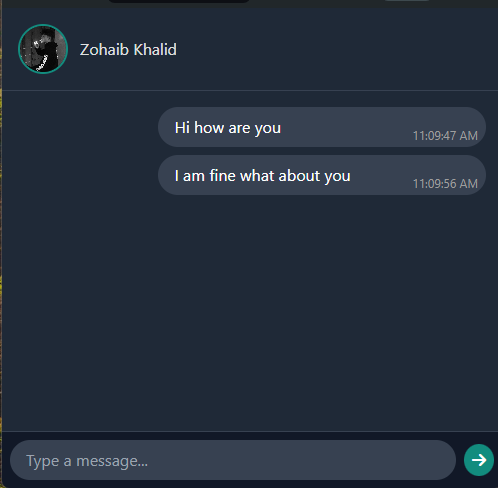

# Real-Time Socket.IO ID Display

This project demonstrates a simple application using **Socket.IO** and **EJS**. Upon clicking a button, the Socket.IO client connects to the server and shows a message it works like a realtime messaging if we open the app in two browser window and the message we'll send from one windows will be shown in the other




## Project Structure

```bash
├── public/             # Public files (e.g., client-side JavaScript, CSS)
|    └── views          # EJS templates
│        └── login.ejs  # Main template with the button to get Socket ID
├── package.json        # Project dependencies
├── server.js           # Node.js server with Socket.IO setup
└── README.md           # This file
```

## Installation

1. Clone this repository to your local machine:

   ```bash
   git clone https://github.com/thezohaibkhalid/Socket-IO-Node.JS/tree/main/Real%20Time%20Messaging.git
   ```

2. Navigate into the project directory:

   ```bash
   cd Real Time Messaging
   ```

3. Install the required dependencies:

   ```bash
   npm install
   ```

4. Start the server:

   ```bash
   node index.js
   ```

5. Open your browser and visit:

   ```bash
   http://localhost:9000
   ```


## Technologies Used

- **Node.js**
- **Express.js**
- **Socket.IO**
- **EJS** (for server-side templating)
- **Tailwind CSS** (for styling)

## Screenshot

Here is what the app looks like:


